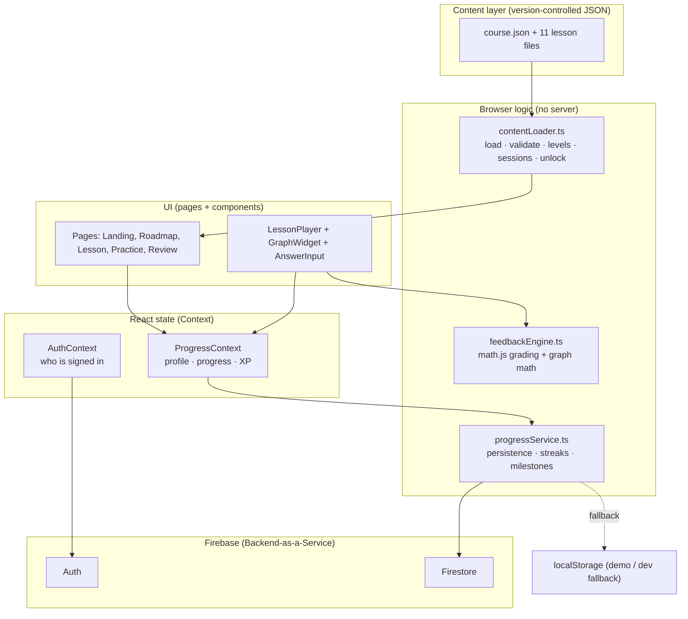
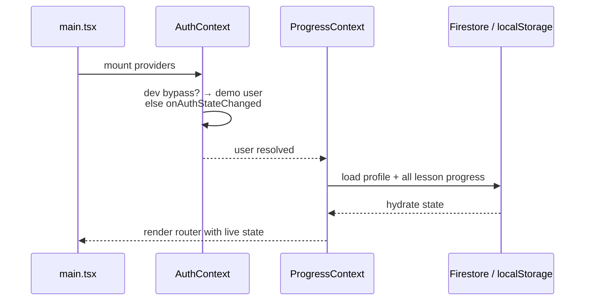
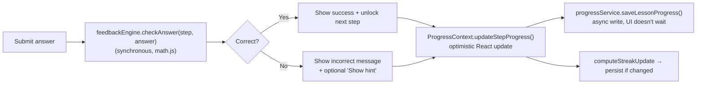

# Introduction to Calculus — App Overview

A Brilliant-style, **learn-by-doing** web app that teaches the foundations of
calculus — derivatives and integrals — through interactive graphs, hands-on
problems, and instant feedback. Built for AP Calculus BC students.

- **Subject:** AP Calculus BC (derivatives → integrals)
- **Stack:** React 19 · TypeScript · Vite 6 · Tailwind CSS 4 · Firebase 11 · KaTeX · math.js
- **Content:** 11 lessons grouped into 5 levels, all hand-authored as JSON
- **Backend:** Firebase (Auth + Firestore), with a zero-config localStorage demo mode

> This document describes what the app can do and how it works internally. For a
> quickstart and setup, see [`README.md`](./README.md).

---

## Table of contents

1. [What the app is](#1-what-the-app-is)
2. [Capabilities](#2-capabilities)
3. [The course](#3-the-course)
4. [Architecture](#4-architecture)
5. [Data model](#5-data-model)
6. [How it works: runtime flows](#6-how-it-works-runtime-flows)
7. [The interactive graph engine](#7-the-interactive-graph-engine)
8. [Grading & feedback](#8-grading--feedback)
9. [Progress, persistence & gamification](#9-progress-persistence--gamification)
10. [Authentication & modes](#10-authentication--modes)
11. [Content authoring & validation](#11-content-authoring--validation)
12. [Routes](#12-routes)
13. [Project setup & scripts](#13-project-setup--scripts)
14. [Deployment](#14-deployment)
15. [Testing](#15-testing)
16. [Design decisions & scope](#16-design-decisions--scope)

---

## 1. What the app is

The app is a single-page React application that teaches calculus the way
Brilliant does: instead of watching a video, the learner is dropped into a short
sequence of **interactive steps**. Each step introduces an idea and then makes
the learner *do* something with it — drag a slider on a live graph, tap a point
on a curve, build a derivative term-by-term, or answer a question — and gives
**instant, specific feedback** on every attempt.

There is **no custom backend server**. The browser does all the rendering,
answer-checking, and lesson logic. Firebase provides only identity (Auth) and
per-user storage (Firestore). When Firebase isn't configured, the app falls back
to `localStorage` so it runs entirely offline for development and demos.

Key principles baked into the build:

- **Depth over breadth** — one subject (calculus), taught through a carefully
  sequenced path, rather than a shallow tour of many topics.
- **Instant feedback** — answers are graded client-side in well under 100 ms;
  nothing waits on the network.
- **Learn by manipulation** — every lesson is required to contain at least one
  hands-on graph interaction.
- **Works before any AI** — all feedback is hand-written. The app contains no AI
  features and teaches fully on its own.

---

## 2. Capabilities

### Learning experience
- **Interactive lessons** made of 6–10 bite-sized steps each.
- **Eleven step/answer types** so problems fit the concept:
  | Type | Learner action | Graded |
  |------|----------------|--------|
  | `read` | Tap **Continue** | No |
  | `multiple_choice` | Pick an option (≥ 4 choices) | Yes |
  | `multi_choice` | Answer several classification rows at once (e.g. max/min/neither) | Yes |
  | `numeric` | Type a number (tolerance-based) | Yes |
  | `slider_graph` | Move a slider on a live SVG graph | Yes |
  | `power_term` | Build a term `a·xⁿ` with steppers (power rule / reverse power rule) | Yes |
  | `drag_drop` | Drag tiles into ordered blanks to assemble an expression | Yes |
  | `match` | Pair each prompt with its match (e.g. function ↔ antiderivative) | Yes |
  | `sign_chart` | Label each interval of a number line (e.g. increasing vs. decreasing) | Yes |
  | `order_list` | Drag shuffled items into their correct order | Yes |
  | `riemann` | Drag a slider to pile up rectangles until a Riemann sum converges | Yes |

  Graph-backed steps can also carry a **slider** answer (drag to a target value)
  or a **graph_point** answer (tap the correct point on the curve).
- **Live, manipulable graphs** rendered as SVG: plot any function, overlay the
  derivative `f'`, show secant/tangent lines, shade the area under a curve
  (integrals), and display live readouts for value, slope, and area. A dedicated
  Riemann widget stacks rectangles under a curve so the area estimate converges
  as the learner adds more.
- **Instant feedback with progressive hints** — correct/incorrect messages are
  authored per step; hints stay hidden behind a "Show hint" button so they never
  give the answer away.
- **Math typesetting** via KaTeX, including inline `$...$` LaTeX inside any
  feedback or prose.

### Course & progression
- **Guided path**: lessons are grouped into **levels** and unlock sequentially —
  lesson *N* opens only after lesson *N−1* is complete.
- **Resume anywhere**: progress is saved per step, so a refresh or device switch
  returns the learner to exactly where they left off.
- **Per-step navigation bar** that doubles as a progress indicator and lets
  learners revisit earlier steps (but not skip ahead to the end).

### Reinforcement (learning-science layer)
- **Per-lesson practice** — each lesson has a *practice bank*; a session samples
  a fresh random subset, favoring hands-on graph questions (retrieval practice).
- **Mixed review** — a cross-lesson session that pulls random questions from
  everything the learner has touched (spaced repetition + interleaving).
- **Level review** — a mixed quiz spanning all lessons in a completed level.

### Habit & motivation
- **XP** for completing lessons (+50) and for first-try-correct practice/review
  answers (+10 each), shown in the header and on the roadmap.
- **Streaks** — consecutive-day activity tracking with a flame badge.
- **Milestones** — achievement badges (first lesson, three lessons, 5-day
  streak, course complete).
- **Celebration screens** on lesson completion and practice results.

### Platform
- **Accounts** via email/password or Google sign-in.
- **Mobile-first, responsive UI** with 44px+ touch targets, safe-area insets,
  portrait/landscape support, and graphs that resize via `ResizeObserver`.
- **Demo/offline mode** that requires no backend at all.

---

## 3. The course

The course (`content/course.json`) is **"Introduction to Calculus"**,
organized into 5 levels and 11 lessons:

| Level | Title | Lessons |
|------:|-------|---------|
| 1 | **What Is a Derivative?** | What Is a Derivative? · Slope of a Curve |
| 2 | **Finding Derivatives** | The Limit Definition of the Derivative · The Power Rule · Differentiating Polynomials |
| 3 | **Using Derivatives** | Derivatives and Graph Shape · Finding Maxima and Minima |
| 4 | **What Is an Integral?** | What Is an Integral? · Area Under a Curve |
| 5 | **The Big Picture** | The Fundamental Theorem of Calculus · Integrating Polynomials |

Each lesson is ~6–8 minutes, contains 6–10 steps, and includes at least one
slider-graph interaction. Lessons that are finished expose **Practice** and
**Review** actions; completed levels expose a **Level review**.

---

## 4. Architecture

### Tech stack

| Layer | Technology |
|-------|------------|
| UI framework | React 19 + TypeScript 5.8 |
| Build tool | Vite 6 |
| Styling | Tailwind CSS 4 |
| Routing | react-router-dom 7 |
| Math display | KaTeX (`react-katex`) |
| Math evaluation | math.js |
| Auth & database | Firebase 11 (Auth + Firestore) |
| Hosting | Firebase Hosting (SPA rewrite) |
| Testing | Vitest + V8 coverage |

### The layered design



The app is built in four conceptual layers:

1. **Content model** — lessons are JSON files describing steps, interactions, and
   hand-written feedback.
2. **Step renderer** — React components render each step type; the feedback
   engine grades answers in the browser.
3. **Progress layer** — `ProgressContext` holds per-lesson state; `progressService`
   syncs it to Firestore or localStorage.
4. **Persistence** — Firebase Auth identifies the user; storage survives across
   sessions and devices.

### Directory structure

```text
content/                     # Course manifest + 11 lesson JSON files
  course.json                #   levels, lesson metadata, ordering
  what-is-a-derivative.json  #   one file per lesson (steps + practiceBank)
  ...

scripts/
  validate-lessons.ts        # CLI: validate every lesson file

src/
  main.tsx                   # React entry point
  App.tsx                    # Routes + provider nesting
  types/content.ts           # Domain types + tuning constants

  lib/
    firebase.ts              # Firebase init + mode flags
    contentLoader.ts         # Import/validate lessons; levels, sessions, unlock
    feedbackEngine.ts        # math.js grading + secant/tangent/derivative math
    progressService.ts       # Firestore/localStorage; streaks, milestones, activity
    masteryService.ts        # Per-concept mastery tiers + weak-area recommendations
    validateLesson.ts        # Lesson-schema validation
    *.test.ts                # Unit tests for the above

  contexts/
    AuthContext.tsx          # Auth hook/types (provided by AuthProvider.tsx)
    AuthProvider.tsx         # login/signup/google/demo + account management
    ProgressContext.tsx      # Progress hook/types (provided by ProgressProvider.tsx)
    ProgressProvider.tsx     # Profile + progress + XP + activity + completion

  components/
    auth/        ProtectedRoute, PasswordInput
    layout/      AppHeader, UserMenu, SafeArea
    lesson/      LessonPlayer, FeedbackPanel, StepNavBar,
                 LessonComplete, PracticeResults
    widgets/     GraphWidget, MathBlock, AnswerInput, MultiChoiceInput,
                 DragDropInput, MatchInput, SignChartInput, OrderListInput,
                 RiemannInput
    roadmap/     LevelSection, LessonCard
    habit/       StreakBadge, XpBadge
    profile/     StatsStrip, ActivityHeatmap, WeakAreas, ConceptMasteryList
    dev/         DevTools

  pages/
    LandingPage, LoginPage, SignupPage, RoadmapPage,
    LessonPage, PracticePage, ReviewPage, LevelReviewPage,
    ProfilePage, SettingsPage

firebase.json                # Hosting + Firestore + Auth config
firestore.rules              # Per-user access rules
firestore.indexes.json
vite.config.ts               # Vite + Tailwind + Vitest config
```

### Provider nesting

```text
AuthProvider → ProgressProvider → BrowserRouter → Routes
```

`AuthContext` resolves *who* the user is; `ProgressContext` then loads that
user's profile and all lesson progress before the router renders pages.

---

## 5. Data model

All domain types live in `src/types/content.ts`. The core hierarchy is
**Course → Level → Lesson → Step → Interaction (graph + answer + feedback)**.

```ts
// A course groups lessons into ordered levels.
interface Course {
  id: "derivatives";
  title: string;
  subject: string;
  description: string;
  levels?: CourseLevel[];   // ordered learning stages
  lessons: LessonMeta[];    // id, title, order, estimatedMinutes, published
}

// A lesson is an ordered list of steps, plus an optional practice pool.
interface Lesson {
  id: string;
  title: string;
  order: number;
  estimatedMinutes: number;
  conceptTags: string[];
  published: boolean;
  steps: Step[];
  practiceBank?: Step[];    // sampled for practice/review sessions
}

// A step renders content, optionally captures an interaction, and carries feedback.
interface Step {
  id: string;
  type: "read" | "multiple_choice" | "multi_choice" | "numeric"
      | "slider_graph" | "power_term" | "drag_drop" | "match"
      | "sign_chart" | "order_list" | "riemann";
  conceptTag?: string;
  content: ContentBlock[];          // text or math (LaTeX) blocks
  interaction?: Interaction;        // graph config + answer spec + hint timing
  feedback: { correct: string; incorrect: string; hint: string };
}

// Eleven answer shapes, each graded by the feedback engine.
type AnswerSpec =
  | { type: "multiple_choice"; options: string[]; correctIndex: number }
  | { type: "multi_choice"; options?: string[]; parts: MultiChoicePart[] }
  | { type: "numeric"; value: number; tolerance?: number }
  | { type: "slider"; value: number; tolerance?: number }
  | { type: "graph_point"; x: number; tolerance?: number }
  | { type: "power_term"; coefficient: number; exponent: number;
      startCoefficient?: number; startExponent?: number; previewPrefix?: string }
  | { type: "drag_drop"; prefix?: string; blanks: DragDropBlank[]; bank: string[] }
  | { type: "match"; pairs: MatchPair[]; distractors?: string[] }
  | { type: "sign_chart"; points: number[]; options: string[];
      regions: SignChartRegion[]; variableLabel?: string }
  | { type: "order_list"; items: string[]; orderLabel?: string }
  | { type: "riemann"; fn: string; a: number; b: number; trueArea: number;
      targetWithin: number; maxRects?: number;
      domain?: [number, number]; yMax?: number };
```

Per-user state:

```ts
interface UserProfile {
  displayName: string;
  email: string;
  streak: { count: number; lastActiveDate: string };
  milestones: string[];
  xp: number;
  activityLog?: Record<string, number>; // questions answered per ISO day → heatmap
  createdAt: string;
  updatedAt: string;
}

interface LessonProgress {
  status: "not_started" | "in_progress" | "complete";
  currentStepIndex: number;
  stepAttempts: Record<string, number>;   // per-step attempt counts
  stepAnswers: Record<string, unknown>;    // last submitted answer per step
  completedAt: string | null;
  updatedAt: string;
}
```

Tuning constants (also in `content.ts`):

| Constant | Value | Meaning |
|----------|------:|---------|
| `MIN_STEPS` / `MAX_STEPS` | 6 / 10 | Allowed steps per lesson |
| `MIN_MC_OPTIONS` | 4 | Minimum multiple-choice options |
| `MIN_MATCH_PAIRS` | 2 | Minimum pairs in a match question |
| `XP_PER_LESSON` | 50 | XP for first completion of a lesson |
| `XP_PER_PRACTICE_CORRECT` | 10 | XP per first-try-correct practice answer |
| `PRACTICE_SESSION_SIZE` | 3 | Questions per practice session |
| `REVIEW_SESSION_SIZE` | 5 | Questions per mixed-review session |
| `PRACTICE_BANK_MIN` | 3 | Minimum questions in a practice bank |
| `PRACTICE_STEPS` | 3 | Size of the legacy fixed practice set (deprecated) |
| `MASTERY_PROFICIENT` / `MASTERY_MASTERED` | 0.6 / 0.9 | First-try accuracy for concept tiers |

---

## 6. How it works: runtime flows

### App boot



### Answer → grade → feedback → save

When the learner taps **Check Answer** in the `LessonPlayer`:



Grading is fully synchronous, so feedback is effectively instant. The progress
write happens in the background; the UI updates optimistically and never blocks
on the network.

### Lesson completion

When the last step is cleared, `LessonPage` calls `completeLesson()`, which:

1. Marks the lesson `complete` and stamps `completedAt`.
2. Recomputes the streak and **milestones**.
3. Awards `XP_PER_LESSON` — **only the first time** a lesson is finished
   (replays and reviews earn nothing, so points can't be farmed).
4. Returns the XP gained; if > 0, a celebration screen shows. The next lesson is
   now unlocked on the roadmap.

### Practice & review sessions

Practice and review reuse the same `LessonPlayer` in **practice mode** against a
*synthetic* lesson whose steps are a freshly sampled set of questions:

- **Per-lesson practice** (`/lesson/:id/practice`) samples `getPracticeSession()`
  from that lesson's bank.
- **Mixed review** (`/review`) samples `getReviewSession()` across every lesson
  the learner has started or completed.
- **Level review** (`/level/:id/review`) samples across all lessons in a level.

In practice mode, progress is **not** persisted (so it can't disturb real lesson
state), only first-try-correct answers count toward the score, and results award
practice XP. Each retry re-samples the bank, so repeated practice stays varied.

### Resume mid-lesson

`LessonPage` reads `progress[lessonId].currentStepIndex` and passes it to the
player as `initialStepIndex`, so a refresh resumes at the same step. A completed
lesson reopens at step 0 in free-review mode (every step unlocked).

---

## 7. The interactive graph engine

`GraphWidget` (`src/components/widgets/GraphWidget.tsx`) is the pedagogical
centerpiece. It renders a function as an SVG plot and supports:

- **Function plotting** — samples `config.fn` across the domain using math.js,
  with auto-computed or explicit y-range, "nice" axis ticks, and gridlines.
- **Derivative overlay** — optionally draws `f'(x)` as a second curve in a
  distinct color (computed numerically), so the learner can line up the sign and
  height of `f'` with where `f` rises, falls, and turns.
- **Secant & tangent lines** — for the "slope of a curve" idea. A special
  `tangentAtFixedPoint` mode draws a static tangent while a secant slides toward
  it as `h → 0`, with a live secant-slope readout.
- **Area shading** — fills the region between the curve and the x-axis from
  `areaStart` to the slider position (the integral visual), with a live numeric
  area estimate computed by the trapezoidal rule.
- **Slider control** — large, touch-friendly range input driving the moving
  point; live readouts for `f(x)`, slope, and area (each individually toggleable).
- **Tap-the-point** — clicking the plot maps the pixel to an x-value; it can snap
  to a step (`pointSnap`) or to discrete visible dots (`pointChoices`) so the
  submitted answer is always exact.
- **Static illustrations** — a non-interactive mode that just shows the curve and
  an optional marked point/tangent, to give typed/picked questions a visual.
- **Responsive sizing** — a `ResizeObserver` tracks container width and recomputes
  the SVG dimensions (width-only, to avoid feedback loops), so graphs adapt to
  rotation and screen size.

The slope/derivative math behind it lives in `feedbackEngine.ts`:

- `evalFunction(fn, x)` — compiled, cached math.js evaluation.
- `secantSlope(fn, x0, h)` — average rate of change.
- `derivativeAt(fn, x)` — instantaneous slope via a central difference (no 0/0
  blow-up).
- `riemannSum(fn, a, b, n)` — midpoint Riemann sum that drives both the
  `RiemannInput` widget's rectangles and the grading of `riemann` steps, so the
  picture and the verdict always agree.

---

## 8. Grading & feedback

`checkAnswer(step, answer)` in `feedbackEngine.ts` is a pure, synchronous
function that returns a `FeedbackResult`. Grading per answer type:

| Answer type | How it's checked |
|-------------|------------------|
| `multiple_choice` | Exact index match against `correctIndex` |
| `multi_choice` | Every row's chosen option must match its `correctIndex` |
| `numeric` / `slider` | `abs(answer − value) ≤ tolerance` (default 0.01) via math.js |
| `graph_point` | `abs(tappedX − x) ≤ tolerance` (default 0.25) |
| `power_term` | Coefficient **and** exponent must match; a 0 coefficient passes regardless of exponent (a constant's derivative) |
| `drag_drop` | Multiset of **signed** placed terms must equal the target (order-free for sums; a `-` slot negates its term) |
| `match` | Every prompt must hold its own `match` (graded by position) |
| `sign_chart` | Every interval's chosen label must match its `correctIndex` (graded by position) |
| `order_list` | The submitted ordering must exactly equal the authored order |
| `riemann` | The midpoint Riemann sum for the chosen `n` must land within `targetWithin` of `trueArea` |

Feedback is rendered by `FeedbackPanel`:

- A **correct** answer turns the panel green, confirms the choice, and reveals
  the **Continue/Finish** button.
- A **wrong** answer turns it amber, shows the authored *incorrect* message, and
  offers a **Show hint** button. The hint is authored per step and only appears
  when the learner explicitly asks — it never reveals the answer outright. The
  wrong choice is flagged but the correct one is never highlighted, so the learner
  can try again.

All messages support inline LaTeX (`$...$`) via the `RichText` renderer.

---

## 9. Progress, persistence & gamification

### Persistence abstraction

`progressService.ts` is the single boundary over storage. Every read/write checks
one flag and routes accordingly:

```text
useLocalPersistence = isDevBypass || !isFirebaseConfigured
```

- **Firestore** (configured production login):
  - `users/{uid}` → `UserProfile`
  - `users/{uid}/progress/{lessonId}` → `LessonProgress`
- **localStorage** (dev or unconfigured): the same data under
  `derivatives_user_profile_{uid}` and `derivatives_progress_{uid}`.

The rest of the app is unaware of which mode is active.

### Streaks

`computeStreakUpdate()` compares today's date to `lastActiveDate`: same day → no
change; yesterday → increment; any older → reset to 1. Updated on any answered
step and on lesson completion.

### Milestones

`checkMilestones()` awards (idempotently):

| ID | Title | Earned when |
|----|-------|-------------|
| `first_lesson` | First Steps | 1 lesson complete |
| `three_lessons` | On a Roll | 3 lessons complete |
| `five_day_streak` | Consistent Learner | 5-day streak |
| `course_complete` | Calculus Master | All lessons complete |

### XP

- **+50** the first time each lesson is completed.
- **+10** per question answered correctly on the first try in practice/review.
- Replaying or reviewing finished material earns no XP. The running total shows in
  the header (`XpBadge`) and the roadmap.

### Concept mastery & profile

`masteryService.ts` rolls every answerable lesson step up by its `conceptTag` into a
**concept catalog**, then scores each concept from saved progress:

- A question is **cleared** when its lesson is complete (or the saved step pointer has moved
  past it), and **first-try** when it was cleared in a single attempt.
- Each concept gets a **tier**: `not_started` → `learning` → `proficient` (fully cleared, ≥ 60%
  first-try) → `mastered` (fully cleared, ≥ 90% first-try).
- `getWeakConcepts()` returns the weakest started-but-unmastered concepts, each linked to the
  best place to practice it.

The **Profile** page (`/profile`) surfaces this as a `StatsStrip`, an `ActivityHeatmap` (driven
by the profile's `activityLog`), a `WeakAreas` list, and a full `ConceptMasteryList`.

### Unlock & recommendation logic (`contentLoader.ts`)

- `isLessonUnlocked()` — lesson *N* unlocks when *N−1* is complete.
- `getLevelStatus()` — a level is `locked`/`not_started`/`in_progress`/`complete`
  based on its lessons.
- `getContinueLessonId()` — the "Continue learning" target: the in-progress
  lesson, else the first unlocked not-started lesson.
- `getCompletionPercent()` / `getLessonProgressPercent()` — progress for the
  roadmap and cards.

---

## 10. Authentication & modes

Auth is handled by `AuthContext` over Firebase Auth, supporting:

- **Email / password** sign-up and login.
- **Google sign-in** (popup), with friendly handling of cancelled popups and a
  guard that steers an existing Google account to *log in* rather than silently
  signing up.

The app runs in one of two modes, decided in `firebase.ts`:

| Mode | When | Auth | Storage |
|------|------|------|---------|
| **Dev / demo bypass** | Vite dev server (`import.meta.env.DEV`, port **5173**) | Auto-logged-in synthetic "Demo Student" | localStorage |
| **Production** | `vite build` / `preview` (port **5174**), Firebase configured | Real Firebase login required | Firestore |

If Firebase env vars are missing (or `VITE_FIREBASE_API_KEY === "demo"`), the app
also falls back to localStorage. `ProtectedRoute` guards the learning routes and
redirects unauthenticated users to `/login`.

**Firestore security rules** (`firestore.rules`) ensure users can only read and
write their own documents:

```text
match /users/{userId} {
  allow read, write: if request.auth != null && request.auth.uid == userId;
  match /progress/{lessonId} {
    allow read, write: if request.auth != null && request.auth.uid == userId;
  }
}
```

A **Settings** page (`/settings`) lets signed-in users manage their account: change the
display name, update email/password (for password accounts), and permanently delete the
account (with re-authentication). Google accounts manage email/password through Google, and
demo-mode changes are saved locally only.

A demo-only **DevTools** panel (visible only under the dev bypass) can complete or
reset all progress for quick testing of locks and milestones.

---

## 11. Content authoring & validation

Lessons are **version-controlled JSON**, imported and frozen at build time in
`contentLoader.ts` (no content API, no CMS). Every lesson is validated both at
import time (`assertValidLesson`) and via a CLI script.

`validateLesson.ts` enforces:

- 6–10 steps per lesson.
- At least one `slider_graph` step.
- Interactive steps must have an answer spec; slider/graph_point/slider_graph
  steps must include a graph config.
- Multiple-choice steps need ≥ 4 options.
- `power_term` answers need a numeric coefficient and integer exponent.
- `multi_choice` questions need ≥ 2 rows, each with ≥ 2 options and an in-range
  correct index.
- `drag_drop` questions need ≥ 1 blank, a duplicate-free tile bank with at least
  one distractor, and every blank's accepted tile present in the bank.
- `match` questions need ≥ 2 pairs, each with a prompt and match, and a unique
  option pool (every match and distractor distinct).
- `sign_chart` questions need ≥ 1 strictly-increasing critical point, ≥ 2
  labels, exactly one more region than points, and each region labeled in range.
- `order_list` questions need ≥ 2 unique items.
- `riemann` questions need `b > a`, a finite `trueArea`, a positive
  `targetWithin`, and no separate graph config (the widget draws its own).
- Non-read steps must have all three feedback fields (correct/incorrect/hint).
- Practice banks must hold ≥ 3 interactive questions with unique IDs.

Run validation anytime:

```bash
npm run validate:lessons
```

A practice **bank** is combined with the lesson's own interactive questions to
form the practice pool, so practice offers the same hands-on graph problems as the
lesson, deduplicated by ID.

Here is a representative step (a `power_term` "derivative builder") from
`content/power-rule.json`:

```json
{
  "id": "pr-step-2",
  "type": "power_term",
  "content": [
    { "type": "text", "body": "Build the derivative of f(x) = x³." }
  ],
  "interaction": {
    "hintAfterAttempts": 1,
    "answer": {
      "type": "power_term",
      "coefficient": 3, "exponent": 2,
      "startCoefficient": 1, "startExponent": 3
    }
  },
  "feedback": {
    "correct": "3x² — you brought the 3 down and reduced the exponent to 2.",
    "incorrect": "Apply the power rule n·xⁿ⁻¹ to x³ ...",
    "hint": "Multiply by the exponent (coefficient → 3), then subtract 1 (→ 2)."
  }
}
```

---

## 12. Routes

| Path | Page | Protected |
|------|------|:---------:|
| `/` | `LandingPage` — hero, course outline | No |
| `/login` | `LoginPage` | No |
| `/signup` | `SignupPage` | No |
| `/lessons` | `RoadmapPage` — levels, progress, streak, mixed review | Yes |
| `/lesson/:lessonId` | `LessonPage` — the lesson player | Yes |
| `/lesson/:lessonId/practice` | `PracticePage` | Yes |
| `/review` | `ReviewPage` — cross-lesson mixed review | Yes |
| `/level/:levelId/review` | `LevelReviewPage` | Yes |
| `/profile` | `ProfilePage` — stats, activity heatmap, concept mastery | Yes |
| `/settings` | `SettingsPage` — account management | Yes |

---

## 13. Project setup & scripts

```bash
# 1. Install dependencies
npm install

# 2. (Optional) add Firebase config for real auth/persistence
#    Create .env.local with the VITE_FIREBASE_* vars below.
#    Without it, the app runs in demo mode (localStorage).

# 3. Start the dev server (demo mode, no login) → http://localhost:5173
npm run dev
```

Environment variables (for production / configured Firebase):

```text
VITE_FIREBASE_API_KEY
VITE_FIREBASE_AUTH_DOMAIN
VITE_FIREBASE_PROJECT_ID
VITE_FIREBASE_STORAGE_BUCKET
VITE_FIREBASE_MESSAGING_SENDER_ID
VITE_FIREBASE_APP_ID
```

Available scripts:

| Command | Description |
|---------|-------------|
| `npm run dev` | Dev server on **5173** (demo user, no login) |
| `npm run build` | Type-check (`tsc -b`) + production bundle |
| `npm run preview` | Preview the production build on **5174** (real login) |
| `npm run lint` | ESLint |
| `npm run test` | Run unit tests once |
| `npm run test:watch` | Watch-mode tests |
| `npm run test:coverage` | Tests with V8 coverage (`src/lib/**`) |
| `npm run validate:lessons` | Validate every lesson JSON file |

---

## 14. Deployment

The app deploys as static files to **Firebase Hosting** with an SPA rewrite
(everything routes to `index.html`). Firestore rules are deployed alongside it.
Configuration lives in `firebase.json` (site `calculus-lab`, public dir `dist`); the
active project is set in `.firebaserc`. The app is live at
**https://calculus-lab.web.app**.

```bash
npm run build
npx -y firebase-tools@latest login
npx -y firebase-tools@latest deploy                  # hosting + firestore rules
# or scope it:
npx -y firebase-tools@latest deploy --only hosting
npx -y firebase-tools@latest deploy --only firestore:rules
```

For real auth in production, enable **Email/Password** and **Google** providers in
the Firebase console and ensure the deployed domains are authorized (the default
`*.web.app` / `*.firebaseapp.com` domains are authorized automatically).

---

## 15. Testing

Unit tests (Vitest) live next to the code they cover under `src/lib/`, with
coverage scoped to `src/lib/**`:

| Test file | Covers |
|-----------|--------|
| `feedbackEngine.test.ts` | Answer grading + function/slope math |
| `progressService.test.ts` | Streaks, milestones, step progression, persistence |
| `contentLoader.test.ts` | Loading, levels, sessions, unlock/completion logic |
| `masteryService.test.ts` | Concept catalog + mastery/weak-area scoring |
| `validateLesson.test.ts` | Lesson-schema validation rules |

```bash
npm run test            # run all
npm run test:coverage   # with coverage report (also written to /coverage)
```

---

## 16. Design decisions & scope

**Why client-side grading?** Brilliant's feel depends on *instant* feedback.
Grading runs synchronously in the browser via math.js; only progress is persisted
asynchronously. Trade-off: answer keys ship in the bundle — fine for an
educational app, not for high-stakes assessment.

**Why JSON content instead of a CMS?** Lessons are version-controlled, validated
at build time and via CLI. Simpler to author and review; the trade-off is that
publishing a lesson is a code deploy, not a button click.

**Why Firebase instead of a custom API?** For auth + per-user documents, Firebase
removes an entire server tier; security rules replace middleware.

**Why dual-mode storage?** Developers and demos must work with zero credentials.
Isolating "where data lives" behind `progressService` keeps the UI unaware of the
mode.

**Why Context instead of Redux/React Query?** The state surface is small — one
user, one profile, one progress map — so Context with optimistic updates is
enough.

**Scope note — no AI.** The app is intentionally AI-free: every problem, hint,
and explanation is hand-authored, and the app teaches fully on its own. math.js
is used for deterministic answer-checking, not generation. The learning-science
layer (practice, spaced/interleaved review, sequential mastery, XP/streaks) is
implemented; AI-assisted hints or problem generation are not part of this build.

**Mastery model.** Per-concept mastery (`learning` / `proficient` / `mastered`) is computed
from saved progress and shown on the profile. Lesson *status* itself still only reaches
`complete` — a `mastered` lesson status is recognized by the unlock/mastery logic for
forward compatibility but is never written.
