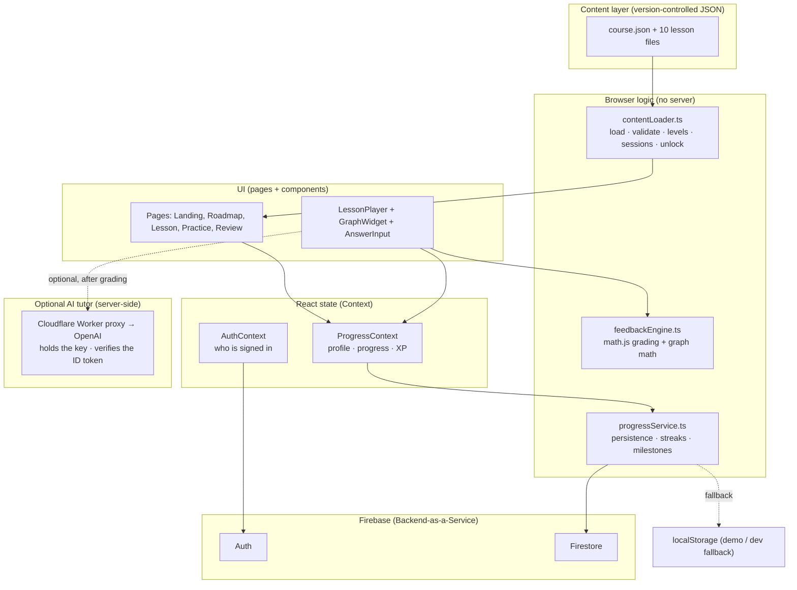
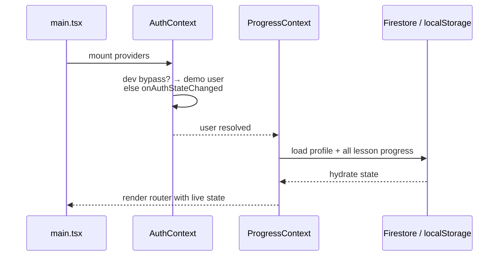
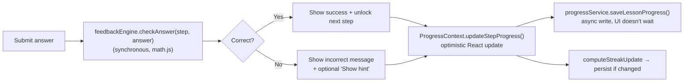

# Introduction to Calculus — App Overview

A Brilliant-style, **learn-by-doing** web app that teaches the foundations of
calculus — derivatives and integrals — through interactive graphs, hands-on
problems, and instant feedback. Built for AP Calculus BC students.

- **Subject:** AP Calculus BC (derivatives → integrals)
- **Stack:** React 19 · TypeScript · Vite 6 · Tailwind CSS 4 · Firebase 11 · Cloudflare Workers · KaTeX · math.js
- **Content:** 10 lessons grouped into 5 levels, plus a reference cheat sheet — all hand-authored as JSON
- **Backend:** Firebase (Auth + Firestore) plus a small Cloudflare Worker proxy for the optional AI tutor, with a zero-config localStorage demo mode

> This document describes what the app can do and how it works internally. For a
> quickstart and setup, see [`README.md`](./README.md).

---

## Table of contents

1. [What the app is](#1-what-the-app-is)
2. [Capabilities](#2-capabilities)
3. [The course](#3-the-course)
4. [Architecture](#4-architecture)
5. [Data model](#5-data-model)
6. [How it works: runtime flows](#6-how-it-works-runtime-flows)
7. [The interactive graph engine](#7-the-interactive-graph-engine)
8. [Grading & feedback](#8-grading--feedback)
9. [Progress, persistence & gamification](#9-progress-persistence--gamification)
10. [Authentication & modes](#10-authentication--modes)
11. [Content authoring & validation](#11-content-authoring--validation)
12. [Routes](#12-routes)
13. [Project setup & scripts](#13-project-setup--scripts)
14. [Deployment](#14-deployment)
15. [Testing](#15-testing)
16. [Design decisions & scope](#16-design-decisions--scope)

---

## 1. What the app is

The app is a single-page React application that teaches calculus the way
Brilliant does: instead of watching a video, the learner is dropped into a short
sequence of **interactive steps**. Each step introduces an idea and then makes
the learner *do* something with it — drag a slider on a live graph, tap a point
on a curve, build a derivative term-by-term, or answer a question — and gives
**instant, specific feedback** on every attempt.

There is **almost no custom backend**: the browser does all the rendering,
answer-checking, and lesson logic, and Firebase provides identity (Auth) and
per-user storage (Firestore). The one exception is a small **Cloudflare Worker
proxy** for the optional AI tutor, which keeps the OpenAI key server-side and
verifies the caller's Firebase ID token (plus an optional per-user rate limit).
When the tutor proxy isn't configured the tutor simply stays hidden, and when
Firebase isn't configured the app falls back to `localStorage` so it runs
entirely offline for development and demos.

Key principles baked into the build:

- **Depth over breadth** — one subject (calculus), taught through a carefully
  sequenced path, rather than a shallow tour of many topics.
- **Instant feedback** — answers are graded client-side in well under 100 ms;
  nothing waits on the network.
- **Learn by manipulation** — every lesson is required to contain at least one
  hands-on graph interaction.
- **Works before any AI** — every problem, hint, and answer key is hand-written
  and graded deterministically in the browser, so the app teaches fully on its
  own. An **optional** AI concept tutor can *explain* a step after it's graded,
  but it never grades or generates problems and is absent unless configured.

---

## 2. Capabilities

### Learning experience
- **Interactive lessons** made of 6–10 bite-sized steps each.
- **Twelve step/answer types** so problems fit the concept:
  | Type | Learner action | Graded |
  |------|----------------|--------|
  | `read` | Tap **Continue** | No |
  | `multiple_choice` | Pick an option (≥ 4 choices) | Yes |
  | `multi_choice` | Answer several classification rows at once (e.g. max/min/neither) | Yes |
  | `numeric` | Type a number (tolerance-based) | Yes |
  | `slider_graph` | Move a slider on a live SVG graph | Yes |
  | `power_term` | Build a term `a·xⁿ` with steppers (power rule / reverse power rule) | Yes |
  | `drag_drop` | Drag tiles into ordered blanks to assemble an expression | Yes |
  | `match` | Pair each prompt with its match (e.g. function ↔ antiderivative) | Yes |
  | `sign_chart` | Label each interval of a number line (e.g. increasing vs. decreasing) | Yes |
  | `order_list` | Drag shuffled items into their correct order | Yes |
  | `riemann` | Drag a slider to pile up rectangles until a Riemann sum converges | Yes |
  | `predict` | Drag a marker along the curve to predict a feature, then lock it in to reveal the truth | Yes |

  Graph-backed steps can also carry a **slider** answer (drag to a target value)
  or a **graph_point** answer (tap the correct point on the curve).
- **Live (continuous) feedback**: any distance-based step (`slider`, `numeric`,
  `power_term`) can set `"liveCheck": true` to be graded as the learner
  manipulates — the same `checkAnswer` runs on every change, the target zone
  shades green, a warmer/colder meter nudges, and the step confirms the instant
  it's satisfied (confirm, don't teleport) with no **Check Answer** press. The
  flagship `predict` step fuses this with direct manipulation: drag a marker to
  predict a feature, commit, and the true point/tangent animates in.
- **Live, manipulable graphs** rendered as SVG: plot any function, overlay the
  derivative `f'`, show secant/tangent lines, shade the area under a curve
  (integrals), and display live readouts for value, slope, and area. A dedicated
  Riemann widget stacks rectangles under a curve so the area estimate converges
  as the learner adds more.
- **Instant feedback with progressive hints** — correct/incorrect messages are
  authored per step; hints stay hidden behind a "Show hint" button so they never
  give the answer away.
- **Math typesetting** via KaTeX, including inline `$...$` LaTeX inside any
  feedback or prose.
- **Optional AI concept tutor** — after a step is graded, the learner can ask an
  AI tutor (OpenAI, behind a Cloudflare Worker proxy) to *explain* the concept.
  It's handed the verdict and the correct answer and asked only to explain — it
  never grades or generates problems. The explanation is personalized with
  PII-free *learner history* (this concept's mastery and how long since it was
  last practiced, plus what's been missed earlier this session). It stays hidden
  unless the tutor proxy URL (`VITE_TUTOR_PROXY_URL`) is configured, so the
  zero-config demo is unaffected.

### Course & progression
- **Guided path**: lessons are grouped into **levels** and unlock sequentially —
  lesson *N* opens only after lesson *N−1* is complete.
- **Resume anywhere**: progress is saved per step, so a refresh or device switch
  returns the learner to exactly where they left off.
- **Per-step navigation bar** that doubles as a progress indicator and lets
  learners revisit earlier steps (but not skip ahead to the end).
- **Reference cheat sheet** — a hand-authored sheet of must-know formulas and
  definitions, one tap from the header (or the roadmap) on any page. It opens as
  a popup over the current page, groups facts by level, and **unlocks level by
  level as the course is completed**, so the sheet grows with progress; each card
  links back to the lesson that teaches it.

### Reinforcement (learning-science layer)
- **Per-lesson practice** — each lesson has a *practice bank*; a session samples
  a fresh random subset, favoring hands-on graph questions (retrieval practice).
- **Targeted review** — a cross-lesson session that ranks the concepts a learner
  has seen by **weakness** (shaky first-try accuracy) and **recency** (time since
  last seen), then interleaves questions from the top concepts (spaced repetition
  + interleaving), backfilling from the broader random pool when needed.
- **Custom practice** — the learner chooses which concepts to drill and how many
  questions (up to 20) to pull into a single session.
- **Level review** — a mixed quiz spanning all lessons in a completed level.

### Habit & motivation
- **XP** for completing lessons (+50) and for first-try-correct practice/review
  answers (+10 each), shown in the header and on the roadmap.
- **Streaks** — consecutive-day activity tracking with a flame badge.
- **Milestones** — 12 achievement badges grouped into Lessons, Practice, Concept
  mastery, Streaks, and Experience (see §9), surfaced on the profile.
- **Celebration screens** on lesson completion and practice results.

### Platform
- **Accounts** via email/password or Google sign-in.
- **Mobile-first, responsive UI** with 44px+ touch targets, safe-area insets,
  portrait/landscape support, and graphs that resize via `ResizeObserver`.
- **Demo/offline mode** that requires no backend at all.

---

## 3. The course

The course (`content/course.json`) is **"Introduction to Calculus"**,
organized into 5 levels and 10 lessons:

| Level | Title | Lessons |
|------:|-------|---------|
| 1 | **What Is a Derivative?** | What Is a Derivative? · Slope of a Curve (introduces the limit definition) |
| 2 | **Finding Derivatives** | The Power Rule · Differentiating Polynomials |
| 3 | **Using Derivatives** | Derivatives and Graph Shape · Finding Maxima and Minima |
| 4 | **What Is an Integral?** | What Is an Integral? · Area Under a Curve |
| 5 | **The Big Picture** | The Fundamental Theorem of Calculus · Integrating Polynomials |

Each lesson is ~6–8 minutes, contains 6–10 steps, and includes at least one
slider-graph interaction. Finished lessons expose per-lesson **Practice**; the
roadmap also offers a cross-lesson **Targeted review** and **Custom practice**,
and completed levels expose a **Level review**. A hand-authored **Reference**
cheat sheet (`content/reference.json`) of the course's key formulas and
definitions is one tap from the header on any page, unlocking level by level as
the course is completed.

---

## 4. Architecture

### Tech stack

| Layer | Technology |
|-------|------------|
| UI framework | React 19 + TypeScript 5.8 |
| Build tool | Vite 6 |
| Styling | Tailwind CSS 4 |
| Routing | react-router-dom 7 |
| Math display | KaTeX (`react-katex`) |
| Math evaluation | math.js |
| Auth & database | Firebase 11 (Auth + Firestore) |
| Hosting | Firebase Hosting (SPA rewrite) |
| AI tutor proxy | Cloudflare Worker → OpenAI (optional) |
| Testing | Vitest + V8 coverage |

### The layered design



The app is built in four conceptual layers:

1. **Content model** — lessons are JSON files describing steps, interactions, and
   hand-written feedback.
2. **Step renderer** — React components render each step type; the feedback
   engine grades answers in the browser.
3. **Progress layer** — `ProgressContext` holds per-lesson state; `progressService`
   syncs it to Firestore or localStorage.
4. **Persistence** — Firebase Auth identifies the user; storage survives across
   sessions and devices.

### Directory structure

```text
content/                     # Course manifest + 10 lesson JSON files + reference deck
  course.json                #   levels, lesson metadata, ordering
  what-is-a-derivative.json  #   one file per lesson (steps + practiceBank)
  ...
  reference.json             #   the Reference cheat-sheet facts

scripts/
  validate-lessons.ts        # CLI: validate every lesson file + the reference deck

src/
  main.tsx                   # React entry point
  App.tsx                    # Routes + provider nesting
  types/content.ts           # Domain types + tuning constants

  lib/
    firebase.ts              # Firebase init + mode flags
    contentLoader.ts         # Import/validate lessons; levels, sessions, unlock
    feedbackEngine.ts        # math.js grading + secant/tangent/derivative math
    progressService.ts       # Firestore/localStorage; streaks, milestones, activity
    masteryService.ts        # Per-concept mastery tiers + weak-area recommendations
    reviewPlanner.ts         # Targeted review: rank concepts by weakness + recency
    learnerInsights.ts       # Per-concept insight + session miss tally for the tutor
    aiTutor.ts               # Optional OpenAI concept tutor; POSTs to the Worker proxy
    inlineMarkup.ts          # Normalize/tokenize inline text + math for rendering
    referenceService.ts      # Load/validate + level-gate the reference cheat sheet
    validateLesson.ts        # Lesson-schema validation
    validateReference.ts     # Reference cheat-sheet validation
    *.test.ts                # Unit tests for the above

  contexts/
    AuthContext.tsx          # Auth hook/types (provided by AuthProvider.tsx)
    AuthProvider.tsx         # login/signup/google/demo + account management
    ProgressContext.tsx      # Progress hook/types (provided by ProgressProvider.tsx)
    ProgressProvider.tsx     # Profile + progress + XP + activity + completion
    SessionInsightsContext.ts   # Session-insights hook (provided by the Provider)
    SessionInsightsProvider.tsx # Tracks per-concept misses this session (tutor)

  hooks/
    useSessionExitGuard.ts   # Confirm before leaving an unfinished session
    useCountUp.ts            # Animated number roll-up (honors reduced motion)

  components/
    auth/        ProtectedRoute, PasswordInput
    common/      Icon, icons (lucide registry), ConfirmDialog
    layout/      AppHeader (incl. Reference button), UserMenu, SafeArea
    lesson/      LessonPlayer, FeedbackPanel, StepNavBar,
                 LessonComplete, PracticeResults, TutorPanel
    widgets/     GraphWidget, MathBlock, AnswerInput, MultiChoiceInput,
                 DragDropInput, MatchInput, SignChartInput, OrderListInput,
                 RiemannInput
    reference/   ReferenceModal (popup cheat sheet), ReferenceCard
    roadmap/     LevelSection, LessonCard
    habit/       StreakBadge, XpBadge, Sparkles, FireFX, ElectricityFX
    profile/     StatsStrip, ActivityHeatmap, WeakAreas, ConceptMasteryList,
                 AchievementsSection
    dev/         DevTools

  pages/
    LandingPage, LoginPage, SignupPage, RoadmapPage,
    LessonPage, PracticePage, ReviewPage, CustomPracticePage,
    LevelReviewPage, ProfilePage, SettingsPage

tutor-proxy/                 # Cloudflare Worker proxy for the AI tutor (active):
                             #   holds the OpenAI key, verifies the Firebase ID token
functions/                   # Equivalent Firebase Cloud Functions tutor proxy
                             #   (alternative for teams already on the Blaze plan)
firebase.json                # Hosting + Firestore + Functions + Auth config
firestore.rules              # Per-user access rules + server-only AI tutor counters/config
firestore.indexes.json
vite.config.ts               # Vite + Tailwind + Vitest config
```

### Provider nesting

```text
AuthProvider → ProgressProvider → SessionInsightsProvider → RouterProvider → Routes
```

`AuthContext` resolves *who* the user is; `ProgressContext` then loads that
user's profile and all lesson progress before the router renders pages.
`SessionInsightsContext` tracks the concepts missed in the current study session
(used to personalize the tutor). A data router (`createBrowserRouter` +
`RouterProvider`) is used so route components can guard navigation away from an
unfinished session.

---

## 5. Data model

All domain types live in `src/types/content.ts`. The core hierarchy is
**Course → Level → Lesson → Step → Interaction (graph + answer + feedback)**,
alongside a separate hand-authored **Reference** deck (`ReferenceFact[]`).

```ts
// A course groups lessons into ordered levels.
interface Course {
  id: "derivatives";
  title: string;
  subject: string;
  description: string;
  levels?: CourseLevel[];   // ordered learning stages
  lessons: LessonMeta[];    // id, title, order, estimatedMinutes, published
}

// A lesson is an ordered list of steps, plus an optional practice pool.
interface Lesson {
  id: string;
  title: string;
  order: number;
  estimatedMinutes: number;
  conceptTags: string[];
  published: boolean;
  steps: Step[];
  practiceBank?: Step[];    // sampled for practice/review sessions
}

// A step renders content, optionally captures an interaction, and carries feedback.
interface Step {
  id: string;
  type: "read" | "multiple_choice" | "multi_choice" | "numeric"
      | "slider_graph" | "power_term" | "drag_drop" | "match"
      | "sign_chart" | "order_list" | "riemann" | "predict";
  conceptTag?: string;
  content: ContentBlock[];          // text or math (LaTeX) blocks
  interaction?: Interaction;        // graph config + answer spec + hint timing
                                    //   + optional liveCheck / goalLabel
  feedback: { correct: string; incorrect: string; hint: string };
}

// Twelve answer shapes, each graded by the feedback engine.
type AnswerSpec =
  | { type: "multiple_choice"; options: string[]; correctIndex: number }
  | { type: "multi_choice"; options?: string[]; parts: MultiChoicePart[] }
  | { type: "numeric"; value: number; tolerance?: number }
  | { type: "slider"; value: number; tolerance?: number }
  | { type: "graph_point"; x: number; tolerance?: number }
  | { type: "predict_point"; x: number; acceptX?: number[]; tolerance?: number;
      reveal: { point?: boolean; tangent?: boolean; vertical?: boolean } }
  | { type: "power_term"; coefficient: number; exponent: number;
      startCoefficient?: number; startExponent?: number; previewPrefix?: string }
  | { type: "drag_drop"; prefix?: string; blanks: DragDropBlank[]; bank: string[] }
  | { type: "match"; pairs: MatchPair[]; distractors?: string[] }
  | { type: "sign_chart"; points: number[]; options: string[];
      regions: SignChartRegion[]; variableLabel?: string }
  | { type: "order_list"; items: string[]; orderLabel?: string }
  | { type: "riemann"; fn: string; a: number; b: number; trueArea: number;
      targetWithin: number; maxRects?: number;
      domain?: [number, number]; yMax?: number };
```

The **Reference** cheat sheet is a separate hand-authored deck, grouped for
display by the level that teaches each fact and unlocked as those levels are
completed:

```ts
interface ReferenceFact {
  id: string;
  title: string;
  lessonId: string;        // teaching lesson: completing it unlocks the fact
  conceptTag?: string;
  formula?: string;        // headline LaTeX; at least one of formula/summary
  summary?: string;        // one-line plain-language statement (inline $…$)
  detail?: ContentBlock[]; // expanded explanation revealed on demand
}
```

Per-user state:

```ts
interface UserProfile {
  displayName: string;
  email: string;
  streak: { count: number; lastActiveDate: string };
  milestones: string[];
  xp: number;
  practiceQuestionsAnswered: number;    // first-try practice/review answers → achievements
  activityLog?: Record<string, number>; // questions answered per ISO day → heatmap
  createdAt: string;
  updatedAt: string;
}

interface LessonProgress {
  status: "not_started" | "in_progress" | "complete";
  currentStepIndex: number;
  stepAttempts: Record<string, number>;   // per-step attempt counts
  stepAnswers: Record<string, unknown>;    // last submitted answer per step
  completedAt: string | null;
  updatedAt: string;
}
```

Tuning constants (also in `content.ts`):

| Constant | Value | Meaning |
|----------|------:|---------|
| `MIN_STEPS` / `MAX_STEPS` | 6 / 10 | Allowed steps per lesson |
| `MIN_MC_OPTIONS` | 4 | Minimum multiple-choice options |
| `MIN_MATCH_PAIRS` | 2 | Minimum pairs in a match question |
| `XP_PER_LESSON` | 50 | XP for first completion of a lesson |
| `XP_PER_PRACTICE_CORRECT` | 10 | XP per first-try-correct practice answer |
| `PRACTICE_SESSION_SIZE` | 3 | Questions per practice session |
| `REVIEW_SESSION_SIZE` | 5 | Questions per targeted-review session |
| `CUSTOM_PRACTICE_DEFAULT_SIZE` / `CUSTOM_PRACTICE_MAX_SIZE` | 5 / 20 | Default & max questions in a custom practice set |
| `PRACTICE_BANK_MIN` | 3 | Minimum questions in a practice bank |
| `MASTERY_PROFICIENT` / `MASTERY_MASTERED` | 0.6 / 0.9 | First-try accuracy for concept tiers |

---

## 6. How it works: runtime flows

### App boot



### Answer → grade → feedback → save

When the learner taps **Check Answer** in the `LessonPlayer`:



Grading is fully synchronous, so feedback is effectively instant. The progress
write happens in the background; the UI updates optimistically and never blocks
on the network.

### Lesson completion

When the last step is cleared, `LessonPage` calls `completeLesson()`, which:

1. Marks the lesson `complete` and stamps `completedAt`.
2. Recomputes the streak and **milestones**.
3. Awards `XP_PER_LESSON` — **only the first time** a lesson is finished
   (replays and reviews earn nothing, so points can't be farmed).
4. Returns the XP gained; if > 0, a celebration screen shows. The next lesson is
   now unlocked on the roadmap.

### Practice & review sessions

Practice and review reuse the same `LessonPlayer` in **practice mode** against a
*synthetic* lesson whose steps are a freshly sampled set of questions:

- **Per-lesson practice** (`/lesson/:id/practice`) samples `getPracticeSession()`
  from that lesson's bank.
- **Targeted review** (`/review`) calls `getTargetedReviewSession()`
  (`reviewPlanner.ts`), which ranks every concept the learner has seen by
  **weakness** (shaky first-try accuracy) and **recency** (time since last seen),
  then interleaves questions from the top concepts — backfilling from the broader
  random pool when targeted material runs short.
- **Custom practice** (`/practice/custom`) lets the learner pick the concepts and
  question count, then samples `getCustomPracticeSession()`.
- **Level review** (`/level/:id/review`) samples across all lessons in a level.

In practice mode, progress is **not** persisted (so it can't disturb real lesson
state), only first-try-correct answers count toward the score, and results award
practice XP. Each retry re-samples the bank, so repeated practice stays varied.

### Resume mid-lesson

`LessonPage` reads `progress[lessonId].currentStepIndex` and passes it to the
player as `initialStepIndex`, so a refresh resumes at the same step. A completed
lesson reopens at step 0 in free-review mode (every step unlocked).

---

## 7. The interactive graph engine

`GraphWidget` (`src/components/widgets/GraphWidget.tsx`) is the pedagogical
centerpiece. It renders a function as an SVG plot and supports:

- **Function plotting** — samples `config.fn` across the domain using math.js,
  with auto-computed or explicit y-range, "nice" axis ticks, and gridlines.
- **Derivative overlay** — optionally draws `f'(x)` as a second curve in a
  distinct color (computed numerically), so the learner can line up the sign and
  height of `f'` with where `f` rises, falls, and turns.
- **Secant & tangent lines** — for the "slope of a curve" idea. A special
  `tangentAtFixedPoint` mode draws a static tangent while a secant slides toward
  it as `h → 0`, with a live secant-slope readout.
- **Area shading** — fills the region between the curve and the x-axis from
  `areaStart` to the slider position (the integral visual), with a live numeric
  area estimate computed by the trapezoidal rule. The readout can instead render
  as a **live definite integral** (`areaReadoutMath`): the ∫ notation typesets
  with a moving upper limit as the learner drags.
- **Slider control** — large, touch-friendly range input driving the moving
  point; live readouts for `f(x)`, slope, and area (each individually toggleable).
- **Tap-the-point** — clicking the plot maps the pixel to an x-value; it can snap
  to a step (`pointSnap`) or to discrete visible dots (`pointChoices`) so the
  submitted answer is always exact.
- **Static illustrations** — a non-interactive mode that just shows the curve and
  an optional marked point/tangent, to give typed/picked questions a visual.
- **Responsive sizing** — a `ResizeObserver` tracks container width and recomputes
  the SVG dimensions (width-only, to avoid feedback loops), so graphs adapt to
  rotation and screen size.

The slope/derivative math behind it lives in `feedbackEngine.ts`:

- `evalFunction(fn, x)` — compiled, cached math.js evaluation.
- `secantSlope(fn, x0, h)` — average rate of change.
- `derivativeAt(fn, x)` — instantaneous slope via a central difference (no 0/0
  blow-up).
- `riemannSum(fn, a, b, n)` — midpoint Riemann sum that drives both the
  `RiemannInput` widget's rectangles and the grading of `riemann` steps, so the
  picture and the verdict always agree.

---

## 8. Grading & feedback

`checkAnswer(step, answer)` in `feedbackEngine.ts` is a pure, synchronous
function that returns a `FeedbackResult`. Grading per answer type:

| Answer type | How it's checked |
|-------------|------------------|
| `multiple_choice` | Exact index match against `correctIndex` |
| `multi_choice` | Every row's chosen option must match its `correctIndex` |
| `numeric` / `slider` | `abs(answer − value) ≤ tolerance` (default 0.01) via math.js |
| `graph_point` | `abs(tappedX − x) ≤ tolerance` (default 0.25) |
| `predict_point` | `abs(draggedX − x) ≤ tolerance` (default 0.3) against `x` or any `acceptX`; same distance check as `graph_point` |
| `power_term` | Coefficient **and** exponent must match; a 0 coefficient passes regardless of exponent (a constant's derivative) |
| `drag_drop` | Multiset of **signed** placed terms must equal the target (order-free for sums; a `-` slot negates its term) |
| `match` | Every prompt must hold its own `match` (graded by position) |
| `sign_chart` | Every interval's chosen label must match its `correctIndex` (graded by position) |
| `order_list` | The submitted ordering must exactly equal the authored order |
| `riemann` | The midpoint Riemann sum for the chosen `n` must land within `targetWithin` of `trueArea` |

Feedback is rendered by `FeedbackPanel`:

- A **correct** answer turns the panel green, confirms the choice, and reveals
  the **Continue/Finish** button.
- A **wrong** answer turns it amber, shows the authored *incorrect* message, and
  offers a **Show hint** button. The hint is authored per step and only appears
  when the learner explicitly asks — it never reveals the answer outright. The
  wrong choice is flagged but the correct one is never highlighted, so the learner
  can try again.
- **Live (`liveCheck`) steps** skip the Check Answer press entirely: `checkAnswer`
  runs on every manipulation and the step confirms the moment it's satisfied,
  while a proximity meter gives warmer/colder nudges. A `predict` step commits on
  **Lock In** and then animates the true point/tangent in.

All messages support inline LaTeX (`$...$`) via the `RichText` renderer.

### Optional AI concept tutor

Once a step is graded, a `TutorPanel` can offer an **optional** AI explanation.
The client (`src/lib/aiTutor.ts`) builds a grounded, PII-free context for the
step and POSTs it to a **Cloudflare Worker proxy** (`tutor-proxy/`) that holds
the OpenAI key server-side, verifies the caller's Firebase ID token, and relays
OpenAI's reply. The deterministic engine stays the only judge: the model is
handed the verdict and the correct answer and asked purely to *explain* the
concept — it never grades or generates problems. Explanations are personalized
with **learner-history** signals (`src/lib/learnerInsights.ts`): the concept's
mastery tier and first-try accuracy, how long since it was last practiced, and
the concepts missed earlier in this session (tracked by `SessionInsightsContext`
and recorded as each answer is graded). The model's loosely-formatted output is
normalized for the KaTeX renderer by `inlineMarkup.ts` (folding `\(…\)`/`$$…$$`
into `$…$`, handling Markdown emphasis). Follow-ups are capped per step
(`MAX_FOLLOWUPS`), and the panel is hidden entirely (`isAiAvailable`) unless the
tutor proxy URL (`VITE_TUTOR_PROXY_URL`) is configured — so the zero-config demo
and offline use are unchanged.

> The repo also ships an equivalent **Firebase Cloud Functions** implementation
> of the same proxy in `functions/` (an alternative for teams already on the
> Blaze plan); the deployed app talks to the Cloudflare Worker.

---

## 9. Progress, persistence & gamification

### Persistence abstraction

`progressService.ts` is the single boundary over storage. Every read/write checks
one flag and routes accordingly:

```text
useLocalPersistence = isDevBypass || !isFirebaseConfigured
```

- **Firestore** (configured production login):
  - `users/{uid}` → `UserProfile`
  - `users/{uid}/progress/{lessonId}` → `LessonProgress`
- **localStorage** (dev or unconfigured): the same data under
  `derivatives_user_profile_{uid}` and `derivatives_progress_{uid}`.

The rest of the app is unaware of which mode is active.

### Streaks

`computeStreakUpdate()` compares today's date to `lastActiveDate`: same day → no
change; yesterday → increment; any older → reset to 1. Updated on any answered
step and on lesson completion.

### Milestones

`checkMilestones(milestones, stats)` awards (idempotently) against a
`MilestoneStats` snapshot built by `buildMilestoneStats(profile, progress)`
(lessons completed, streak, XP, practice questions answered, and concepts
mastered). The metrics are `lessons`, `streak`, `course`, `xp`, `questions`,
`concepts`, and `allConcepts`; `course`/`allConcepts` use a live target and are
guarded so an empty course can't award them. Checked on every answered step,
lesson completion, and practice/review session, so XP-, question-, and
concept-based badges unlock the moment their threshold is reached.

The `questions` metric counts only practice/review questions cleared on the
first try (tracked on `UserProfile.practiceQuestionsAnswered`, incremented by
`addXp` with the session's first-try count); lesson-walkthrough questions and
questions that needed more than one attempt do not count.

In the profile UI, achievements are grouped into sections (`MILESTONE_SECTIONS`)
and `MILESTONE_ORDER` is derived from that grouping:

| Section | ID | Title | Earned when |
|---------|----|-------|-------------|
| Lessons | `first_lesson` | First Steps | 1 lesson complete |
| Lessons | `three_lessons` | On a Roll | 3 lessons complete |
| Lessons | `course_complete` | Calculus Master | All lessons complete |
| Practice | `questions_10` | Warming Up | 10 practice questions cleared first try |
| Practice | `questions_25` | Getting Reps In | 25 practice questions cleared first try |
| Practice | `questions_50` | Practice Pro | 50 practice questions cleared first try |
| Practice | `questions_100` | Century | 100 practice questions cleared first try |
| Concept mastery | `concepts_3` | Concept Explorer | 3 concepts mastered |
| Concept mastery | `all_concepts` | Concept Conqueror | Every concept mastered |
| Streaks | `five_day_streak` | Consistent Learner | 5-day streak |
| Experience | `xp_250` | Point Collector | 250 XP earned |
| Experience | `xp_1000` | XP Champion | 1,000 XP earned |

### XP

- **+50** the first time each lesson is completed.
- **+10** per question answered correctly on the first try in practice/review.
- Replaying or reviewing finished material earns no XP. The running total shows in
  the header (`XpBadge`) and the roadmap.

### Concept mastery & profile

`masteryService.ts` rolls every answerable lesson step up by its `conceptTag` into a
**concept catalog**, then scores each concept from saved progress:

- A question is **cleared** when its lesson is complete (or the saved step pointer has moved
  past it), and **first-try** when it was cleared in a single attempt.
- Each concept gets a **tier**: `not_started` → `learning` → `proficient` (fully cleared, ≥ 60%
  first-try) → `mastered` (fully cleared, ≥ 90% first-try).
- `getWeakConcepts()` returns the weakest started-but-unmastered concepts, each linked to the
  best place to practice it.

The **Profile** page (`/profile`) surfaces this as a `StatsStrip`, an `ActivityHeatmap` (driven
by the profile's `activityLog`), a `WeakAreas` list, and a full `ConceptMasteryList`.

### Unlock & recommendation logic (`contentLoader.ts`)

- `isLessonUnlocked()` — lesson *N* unlocks when *N−1* is complete.
- `getLevelStatus()` — a level is `locked`/`not_started`/`in_progress`/`complete`
  based on its lessons.
- `getContinueLessonId()` — the "Continue learning" target: the in-progress
  lesson, else the first unlocked not-started lesson.
- `getCompletionPercent()` / `getLessonProgressPercent()` — progress for the
  roadmap and cards.

---

## 10. Authentication & modes

Auth is handled by `AuthContext` over Firebase Auth, supporting:

- **Email / password** sign-up and login.
- **Google sign-in** (popup), with friendly handling of cancelled popups and a
  guard that steers an existing Google account to *log in* rather than silently
  signing up.

The app runs in one of two modes, decided in `firebase.ts`:

| Mode | When | Auth | Storage |
|------|------|------|---------|
| **Dev / demo bypass** | Vite dev server (`import.meta.env.DEV`, port **5173**) | Auto-logged-in synthetic "Demo Student" | localStorage |
| **Production** | `vite build` / `preview` (port **5174**), Firebase configured | Real Firebase login required | Firestore |

If Firebase env vars are missing (or `VITE_FIREBASE_API_KEY === "demo"`), the app
also falls back to localStorage. `ProtectedRoute` guards the learning routes and
redirects unauthenticated users to `/login`.

**Firestore security rules** (`firestore.rules`) ensure users can only read and
write their own documents:

```text
match /users/{userId} {
  allow read, write: if request.auth != null && request.auth.uid == userId;
  match /progress/{lessonId} {
    allow read, write: if request.auth != null && request.auth.uid == userId;
  }
}
// Server-only: the AI tutor's per-user rate-limit counters and global config
// (e.g. an `enabled` kill switch) are written by the Admin SDK only.
match /aiUsage/{uid}   { allow read, write: if false; }
match /config/{docId}  { allow read, write: if false; }
```

A **Settings** page (`/settings`) lets signed-in users manage their account: change the
display name, update email/password (for password accounts), and permanently delete the
account (with re-authentication). Google accounts manage email/password through Google, and
demo-mode changes are saved locally only.

A demo-only **DevTools** panel (visible only under the dev bypass) can complete or
reset all progress for quick testing of locks and milestones.

---

## 11. Content authoring & validation

Lessons are **version-controlled JSON**, imported and frozen at build time in
`contentLoader.ts` (no content API, no CMS). Every lesson is validated both at
import time (`assertValidLesson`) and via a CLI script. The **Reference** cheat
sheet (`content/reference.json`) is validated the same way (`validateReference.ts`
/ `assertValidReferenceFacts`).

`validateLesson.ts` enforces:

- 6–10 steps per lesson.
- At least one `slider_graph` step.
- Interactive steps must have an answer spec; slider/graph_point/predict_point/
  slider_graph steps must include a graph config.
- Multiple-choice steps need ≥ 4 options.
- `power_term` answers need a numeric coefficient and integer exponent.
- `multi_choice` questions need ≥ 2 rows, each with ≥ 2 options and an in-range
  correct index.
- `drag_drop` questions need ≥ 1 blank, a duplicate-free tile bank with at least
  one distractor, and every blank's accepted tile present in the bank.
- `match` questions need ≥ 2 pairs, each with a prompt and match, and a unique
  option pool (every match and distractor distinct).
- `sign_chart` questions need ≥ 1 strictly-increasing critical point, ≥ 2
  labels, exactly one more region than points, and each region labeled in range.
- `order_list` questions need ≥ 2 unique items.
- `riemann` questions need `b > a`, a finite `trueArea`, a positive
  `targetWithin`, and no separate graph config (the widget draws its own).
- `predict_point` questions need a graph config, a finite `x` (and finite
  `acceptX`), a positive `tolerance` when set, and a `reveal` spec.
- Non-read steps must have all three feedback fields (correct/incorrect/hint).
- Graded **lesson** steps must include a `solution` (worked-solution blocks)
  powering the "Solve it" assistance level; practice questions are exempt.
- Practice banks must hold ≥ 3 interactive questions with unique IDs.

The reference deck has its own checks (`validateReference.ts`): every fact needs
a unique id, a title, at least one of `formula`/`summary`, and a `lessonId` that
resolves to a real published lesson. The `validate:lessons` CLI runs the lesson
checks **and** the reference checks in one pass.

Run validation anytime:

```bash
npm run validate:lessons
```

A practice **bank** is combined with the lesson's own interactive questions to
form the practice pool, so practice offers the same hands-on graph problems as the
lesson, deduplicated by ID.

Here is a representative step (a `power_term` "derivative builder") from
`content/power-rule.json`:

```json
{
  "id": "pr-step-2",
  "type": "power_term",
  "content": [
    { "type": "text", "body": "Build the derivative of f(x) = x³." }
  ],
  "interaction": {
    "answer": {
      "type": "power_term",
      "coefficient": 3, "exponent": 2,
      "startCoefficient": 1, "startExponent": 3
    }
  },
  "solution": [
    { "type": "text", "body": "Apply the power rule to $x^3$: the exponent 3 drops down to become the coefficient, and the new exponent is 3 − 1 = 2." },
    { "type": "math", "latex": "\\frac{d}{dx}(x^3) = 3x^{2}", "display": true }
  ],
  "feedback": {
    "correct": "3x² — you brought the 3 down and reduced the exponent to 2.",
    "incorrect": "Apply the power rule n·xⁿ⁻¹ to x³ ...",
    "hint": "Multiply by the exponent (coefficient → 3), then subtract 1 (→ 2)."
  }
}
```

Every question also carries a learner-facing **assistance toggle**
(`AssistanceToggle.tsx`): **Solve it** (shows the interactive question first, then
a "Work through it" button that animates the widget to the answer while the
concept-to-answer `solution` reveals step by step — lesson questions only, and
excluded from mastery since it's a worked example), **Hints** (live "warmer/colder" feedback while interacting on
value-tuning questions, plus the authored hint offered proactively and the AI tutor),
or **No help** (hints and tutor hidden). The choice is a sticky per-learner
preference (`useAssistancePreference.ts`, default Hints); practice questions offer
only Hints / No help.

A graph step may carry an optional `solveAnimation` recipe (e.g.
`{ "kind": "secant", "a": 1, "b": 3 }`) that the "Solve it" walkthrough plays
instead of the generic slider sweep — the secant recipe draws a "rate of change
between two points" demo. The live x / f(x) readouts are hidden during any
walkthrough so values don't flash.

---

## 12. Routes

| Path | Page | Protected |
|------|------|:---------:|
| `/` | `LandingPage` — hero, course outline | No |
| `/login` | `LoginPage` | No |
| `/signup` | `SignupPage` | No |
| `/lessons` | `RoadmapPage` — levels, progress, streak, targeted review & custom practice | Yes |
| `/lesson/:lessonId` | `LessonPage` — the lesson player | Yes |
| `/lesson/:lessonId/practice` | `PracticePage` | Yes |
| `/review` | `ReviewPage` — cross-lesson **targeted** review | Yes |
| `/practice/custom` | `CustomPracticePage` — pick concepts + session size | Yes |
| `/level/:levelId/review` | `LevelReviewPage` | Yes |
| `/profile` | `ProfilePage` — stats, activity heatmap, concept mastery | Yes |
| `/settings` | `SettingsPage` — account management | Yes |

The **Reference** cheat sheet isn't a route — it opens as a popup over the
current page from the header (and the roadmap), so it never pulls the learner out
of a lesson or session.

---

## 13. Project setup & scripts

```bash
# 1. Install dependencies
npm install

# 2. (Optional) add Firebase config for real auth/persistence
#    Create .env.local with the VITE_FIREBASE_* vars below.
#    Without it, the app runs in demo mode (localStorage).

# 3. Start the dev server (demo mode, no login) → http://localhost:5173
npm run dev
```

Environment variables (for production / configured Firebase):

```text
VITE_FIREBASE_API_KEY
VITE_FIREBASE_AUTH_DOMAIN
VITE_FIREBASE_PROJECT_ID
VITE_FIREBASE_STORAGE_BUCKET
VITE_FIREBASE_MESSAGING_SENDER_ID
VITE_FIREBASE_APP_ID

# Optional
VITE_FIREBASE_APPCHECK_SITE_KEY   # App Check (reCAPTCHA Enterprise) for Firestore hardening
VITE_TUTOR_PROXY_URL              # deployed Cloudflare Worker URL → enables the AI tutor
```

Available scripts:

| Command | Description |
|---------|-------------|
| `npm run dev` | Dev server on **5173** (demo user, no login) |
| `npm run build` | Type-check (`tsc -b`) + production bundle |
| `npm run preview` | Preview the production build on **5174** (real login) |
| `npm run lint` | ESLint |
| `npm run test` | Run unit tests once |
| `npm run test:watch` | Watch-mode tests |
| `npm run test:coverage` | Tests with V8 coverage (`src/lib/**`) |
| `npm run validate:lessons` | Validate every lesson JSON file + the reference deck |
| `npm run kill-ports` | Free the dev/preview ports (5173 / 5174) |

---

## 14. Deployment

The app deploys as static files to **Firebase Hosting** with an SPA rewrite
(everything routes to `index.html`). Firestore rules are deployed alongside it.
Configuration lives in `firebase.json` (site `calculus-lab`, public dir `dist`); the
active project is set in `.firebaserc`. The app is live at
**https://calculus-lab.web.app**. The optional AI tutor proxy deploys separately
to Cloudflare (see [`tutor-proxy/README.md`](./tutor-proxy/README.md)).

```bash
npm run build
npx -y firebase-tools@latest login
npx -y firebase-tools@latest deploy --only hosting,firestore:rules
# or scope it further:
npx -y firebase-tools@latest deploy --only hosting
npx -y firebase-tools@latest deploy --only firestore:rules
```

For real auth in production, enable **Email/Password** and **Google** providers in
the Firebase console and ensure the deployed domains are authorized (the default
`*.web.app` / `*.firebaseapp.com` domains are authorized automatically).

---

## 15. Testing

Unit tests (Vitest) live next to the code they cover under `src/lib/`, with
coverage scoped to `src/lib/**`:

| Test file | Covers |
|-----------|--------|
| `feedbackEngine.test.ts` | Answer grading + function/slope math |
| `progressService.test.ts` | Streaks, milestones, step progression, persistence |
| `contentLoader.test.ts` | Loading, levels, sessions, unlock/completion logic |
| `masteryService.test.ts` | Concept catalog + mastery/weak-area scoring |
| `reviewPlanner.test.ts` | Targeted-review ranking (weakness + recency) |
| `learnerInsights.test.ts` | Concept insight + session miss tally for the tutor |
| `aiTutor.test.ts` | Tutor context building + answer descriptions |
| `inlineMarkup.test.ts` | Inline math/markdown normalization + tokenizing |
| `referenceService.test.ts` | Reference grouping + level-gated unlocking |
| `validateLesson.test.ts` | Lesson-schema validation rules |

```bash
npm run test            # run all
npm run test:coverage   # with coverage report (also written to /coverage)
```

---

## 16. Design decisions & scope

**Why client-side grading?** Brilliant's feel depends on *instant* feedback.
Grading runs synchronously in the browser via math.js; only progress is persisted
asynchronously. Trade-off: answer keys ship in the bundle — fine for an
educational app, not for high-stakes assessment.

**Why JSON content instead of a CMS?** Lessons are version-controlled, validated
at build time and via CLI. Simpler to author and review; the trade-off is that
publishing a lesson is a code deploy, not a button click.

**Why Firebase instead of a custom API?** For auth + per-user documents, Firebase
removes an entire server tier; security rules replace middleware.

**Why dual-mode storage?** Developers and demos must work with zero credentials.
Isolating "where data lives" behind `progressService` keeps the UI unaware of the
mode.

**Why Context instead of Redux/React Query?** The state surface is small — one
user, one profile, one progress map — so Context with optimistic updates is
enough.

**Scope note — AI is optional and never grades.** Every problem, hint, and
answer key is hand-authored, and all grading is deterministic (math.js, used for
answer-checking, not generation), so the app teaches fully on its own with no AI.
An **optional** AI concept tutor (OpenAI, behind a Cloudflare Worker proxy) can
layer on top to *explain* a step *after* it's graded — it's given the verdict and
the correct answer and only explains; it never grades or generates problems, and
it stays hidden unless the tutor proxy URL (`VITE_TUTOR_PROXY_URL`) is configured.
Keeping the OpenAI key on the Worker lets the app deploy publicly on Firebase's
free Spark plan (no Cloud Functions / Blaze required). The learning-science layer
(practice, targeted/interleaved review, custom practice, sequential mastery,
XP/streaks) is implemented.

**Mastery model.** Per-concept mastery (`learning` / `proficient` / `mastered`) is computed
from saved progress and shown on the profile. Lesson *status* itself still only reaches
`complete` — a `mastered` lesson status is recognized by the unlock/mastery logic for
forward compatibility but is never written.
